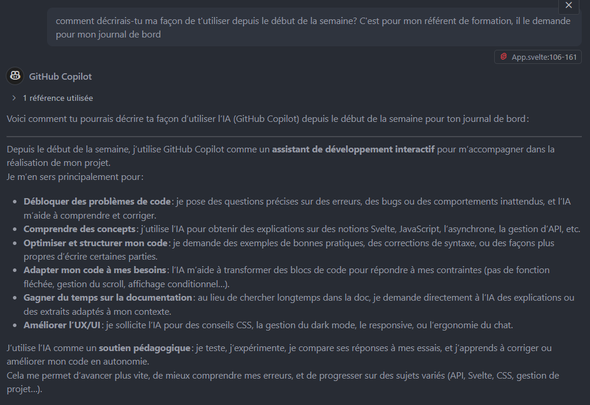

# Journal de développement

## 🗓️ Jour 1

- Intégration terminée avec prise en charge du responsive

## 🗓️ Jour 2

- Intégration du menu burger pour les écrans smartphone
- Finalisation du responsive
- Début du call API avec **Mistral**
- Démarrage de l'affichage dans le chat (via **Lia**)
- Création de l'encart de vérification du token pour Lia

## 🗓️ Jour 3

- Mise en place du **dark mode**
- Amélioration de la vérification du token
- Réorganisation du code
- Structuration des échanges avec Lia sous forme de tableau de discussion
- Finalisation de l’interaction avec Lia
- Connexion établie avec **Pocketbase**
- Reprise de la réactivité du chat (initialement gérée par l’IA)
- Quelques améliorations de **CSS**
- Début de la sauvegarde sur Pocketbase

## comment j utilise l ia

ps: ce carnet de bord a été mis en forme par IA
